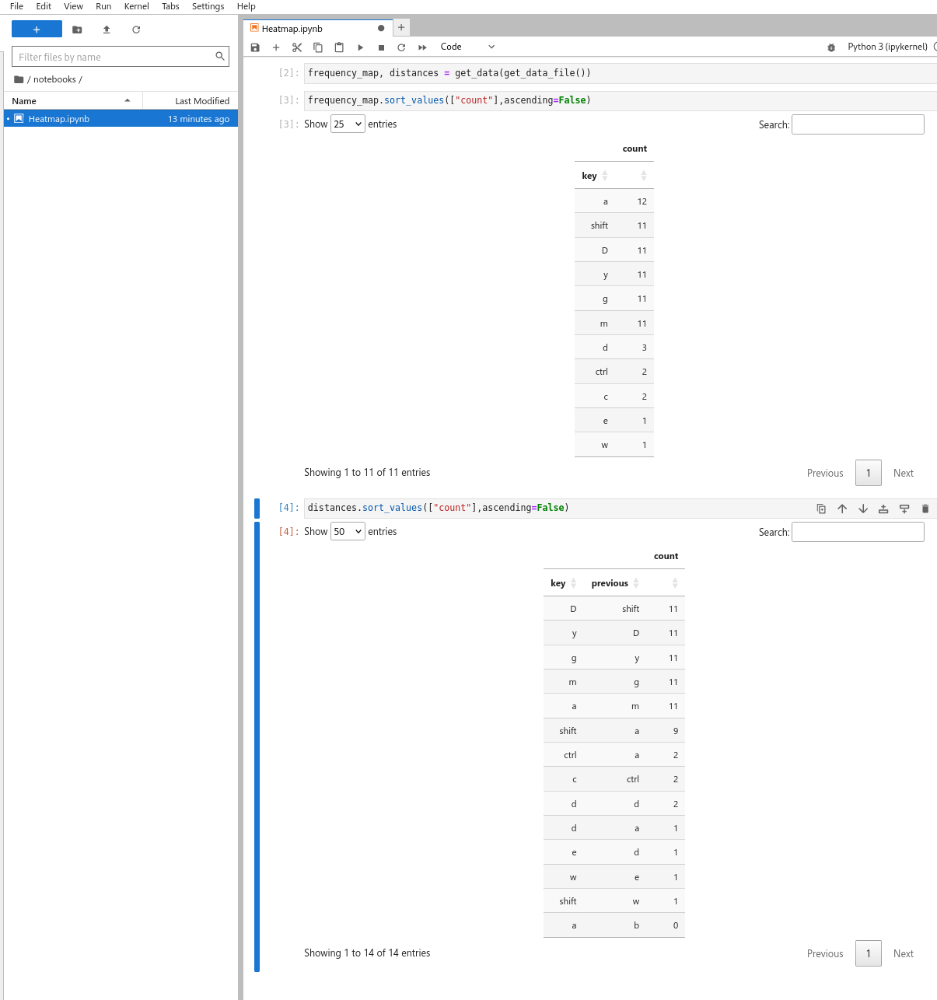

# Python Typing Analyzer (Pyta)

Pyta is a small tool to analyze your typing behavior, giving you insights into the keys you use frequently and in which combinations. It is intended to give a nice heat map to optimize your keyboard layout and macros for keyboards with high levels of customizability like the [Dygma Raise](https://dygma.com/products/dygma-raise) and [Dygma Defy](https://dygma.com/pages/defy).

It has been tested to work on linux, and uses pynput under the hood. That libary claims to also work with MacOSX and Windows, so it should run on those platforms too, even though that hasn't been tested by me.

## WARNING
This tool logs your keyboard activity. It does NOT store exact key sequences, but it still logs the frequency of your typed keys, and which combinations of keys are frequently typed together. This tool does NOT upload any data, nor connect to any server or service online beyond what is necessary to install packages through python's pip package manager. Still, the tool should be used with care, and the local files it stores should be kept private. They would be very helpful for anyone trying to guess your passwords for instance. Depending on your operating system, the files are stored in `~/.local/share/pyta/` or `C:\Users\<username>\AppData\pyta` or `~/Library/Application Support/pyta` and they can be removed at any time.

## Installation
Make sure you have python and pip installed and have checked out the git repository and moved to that directory.

* `pip install .`

If you also want jupyter notebooks (there is an example included) to visualize the data, it's recommended to install in a virtual env like this:

* `poetry install --with=jupyter`

## Running
If you installed using `pip install .` you can just run
* `pyta`

If you installed with a virtual environment, you can run pyta with

* `poetry run pyta`

### Visualization

You can visualize the data any way you like. The data is stored as hdf file, which is basically a file with multiple tables. I like visualizing data with [jupyter lab](https://jupyter.org/),  and there is a sample notebook included that helps you with that. You can run jupyter lab with
* `poety run jupyter lab`

It will open a web application, and on the left side you can browse to the `notebooks` folder where you'll find a sample notebook. For convenience sake, I added dependencies for [plotly](https://plotly.com/python/), [seaborn](https://seaborn.pydata.org/) and [itables](https://github.com/mwouts/itables) in the installation dependencies, which gives you pretty nice visualization tools.

